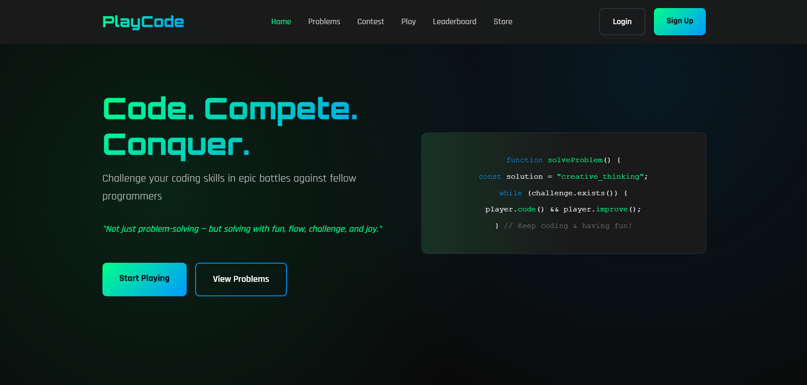

# PlayCode

### **Not just problem-solving — but solving with fun, flow, challenge, and joy**

## 🎯 Purpose of This Project

In today’s tech world, problem-solving is one of the most important and in-demand skills. While AI can handle repetitive tasks, boilerplate code, and many other operations in seconds, the true value lies in your problem-solving abilities.  

As someone who loves both coding and gaming, I wanted to create an environment where learning and fun go hand-in-hand. This app transforms traditional problem-solving into a **game-like experience**, making it engaging and exciting.  

**Players can:**  

      1. Solve coding problems with joy and challenge  
         
      2. Compete against opponents in time-based problem-solving contests  
         
      3. Earn XP, track progress, and see leaderboard rankings  
         
      4. Redeem prizes and unlock rewards  
         
      5. Build connections and collaborate with fellow coders  
         
      6. Interact with the community and learn from peers  
         
      7. Improve time management and enhance problem-solving skills  

      and more..........

---
A modern problem-solving & coding practice platform built with **Node.js (Express)** and **vanilla HTML/CSS/JS**.  
The goal is to create a **unique, learner-friendly coding experience** with features like hints, analytics, and gamification.  

# 🚀 PlayCode — Level Up Your Coding Skills with Fun!

---
 
**Vision:** Build a secure, engaging, and scalable platform for learning and competitive coding — combining production-quality judge infrastructure, strong community features, and a playful coin-based economy that drives retention.

---

## Table of contents
1. [Executive Summary](#executive-summary)  
2. [Roadmap Overview & Release Strategy](#roadmap-overview--release-strategy)  
3. [Versioned Roadmap](#versioned-roadmap-professional-prioritized)  
4. [Cross-Cutting Concerns (Security, Observability, Compliance)](#cross-cutting-concerns-security-observability-compliance)  
5. [Data Model](#data-model-high-level)  
6. [Technical Stack](#recommended-technical-stack)  
7. [KPIs & Success Metrics](#kpis--success-metrics)    

---

## 1. Executive Summary

**PlayCode will deliver a polished coding platform focused on three core value propositions:**

      1.Solve & Learn: Robust problem-solving flows (editor, judge, feedback).  
      
      2. Compete & Progress: Contests, leaderboards, quizzes, and team competitions.  
      
      3. Engage & Retain: Community interactions, gamification (coins, badges), and a small commerce layer (store).

---

## 2. Roadmap Overview & Release Strategy

      1. MVP (Phase 0/1 — Launch): Core pages + authentication + judge integration + basic gamification + leaderboards + admin tools. 
      Validate retention and problem-solving frequency.  
      
      2. Phase 2 (Grow): Community, quizzes, store, and enhanced analytics.  
      
      3. Phase 3 (Scale): Team contests, advanced anti-cheat, payments & revenue features, AI recommendations, and localization.

**Priority emphasis: identity, safe code execution, moderation, and observability.**

---

## 3. Versioned Roadmap

### Version 1 — Foundation: UI, Pages & Design System  

**Goal:** Ship a polished public-facing site and core page scaffolding.

      1. Pages: Home, Problems, Contests (listing), Play (hub), Store (catalog), Player Dashboard, Docs/Help.  
      
      2. Global components: Top nav (logo, search, notifications, profile), footer, responsive layout.
      
      3. Design system: Tailwind-ready tokens, typography scale, card patterns, forms, color system, and accessibility (WCAG basics).
      
      4. Monaco Editor stub integrated (readonly until judge ready).

---

### Version 2 — Authentication & User Profiles

**Goal:** Establish identity and trust.

      1. Email/password signup & login, email verification, password reset.
      
      2 .OAuth: Google + GitHub.  
      
      3. Profile flow: username, avatar, bio, preferred languages, timezone.
      
      4. Session management (JWT + refresh), basic security headers, account settings.  
      
      5. Minimal privacy & TOS pages; cookie consent banner.

---

### Version 3 — Judge Integration & Safe Code Execution

**Goal:** Enable secure code execution for submissions and contests.

      1. MVP approach: Hosted judge (Judge0 or Piston).  
      
      2. Long-term: architecture for in-house runner (Dockerized sandbox or microVM) + job queue (BullMQ/Redis).  
      
      3. Safety: time & memory limits, CPU quotas, per-user rate limits, container teardown. 
      
      4. Submission API flow: createSubmission → enqueue → runner → callback/webhook → persist verdict.

---

### Version 4 — Problem Solving Flow & Submission History  

**Goal:** Complete end-to-end solve cycle with user-visible history.

      1. Monaco editor + test case panel + run & submit.  
      
      2. Submission history with verdicts, runtimes, outputs.  
      
      3. Hidden testcases & grader metadata support.  
      
      4. UX for first-time users and failure cases.

---

### Version 5 — Leaderboards, Badges & Core Gamification  

**Goal:** Create incentives for competition and repeat usage.

      1. Global & weekly leaderboards (solved count, contest score, coins). 
      
      2. Badges & achievements engine.  
      
      3. Coin rewards (transaction ledger).  
      
      4. Daily streaks and first-time completion rewards.

---

### Version 6 — Admin & Moderation Tools

**Goal:** Manage abuse, content, and coin economy.

      1. Admin panel: user management (ban/unban), manual coin adjustments, contest creation, moderation queue.  
      
      2. Reports system: flag submissions, comments, user profiles.  
      
      3. Audit logs for sensitive actions (transaction reversals, bans).

---

### Version 7 — Quizzes, Short-Form Play & Play Page Hub  

**Goal:** Increase discoverability and short-session engagement.

      1. Play hub with quick-start challenge and mode selector (Practice, Challenge, Speed Run).  
      
      2. Quiz engine: timed multiple-choice and code-completion quizzes.  
      
      3. Earn PlayCoins for participation/correct answers; quiz leaderboards.  
      
      4. Real-time progress tracker and instant rewards.

---

### Version 8 — Community Features (Discussion & Peer Feedback)  

**Goal:** Social features to grow retention and create content.

      1. Problem-level discussions, comments, upvotes.  
      
      2. Peer feedback flows: mark helpful answers, accept suggestions.  
      
      3. Reputation points and helper badges.  
      
      4. Notification system (in-app + email digests).

---

### Version 9 — Store, Economy, & Small Commerce  

**Goal:** Monetization surface and coin sinks to balance the economy.

      1. PlayCoin ledger (immutable transactions).  
      
      2. Store: buy themes, badges, boosts (virtual goods only).  
      
      3. Coin purchase integration (Stripe) — receipts, disputes, refund workflows.  
      
      4. Analytics for coin velocity & sink effectiveness.

---

### Version 10 — Team Contests & Advanced Competition Modes  

**Goal:** Deep social competitions and collaborative events.
      
      1. Team creation/joining, shared team leaderboards, team-based contest format.  
      
      2. Group challenge scoring & shared rewards.  
      
      3. Admin tooling for scheduled tournaments and prizes.

---

## 4. Cross-Cutting Concerns (Security, Observability, Compliance)

      1. Anti-cheat & Plagiarism Detection: randomized hidden tests, submission similarity detection (MOSS-like), 
      heuristics to flag suspicious behavior.  
      
      2. Rate limiting & Abuse Prevention: Redis-backed quotas for submissions, API throttling.  
      
      3. Monitoring: Sentry (errors), Prometheus/Grafana (metrics), centralized logging (Loki/ELK).  
      
      4. Backups & Migrations: scheduled DB backups (pgdump), schema migration tools (Prisma/Flyway).  
      
      5. Legal & Privacy: privacy policy, TOS, GDPR preparedness, email opt-ins.

---

## 5. Data Model

      Manage data efficiently. 
      
---

## 6. Technical Stack

      Frontend: Next.js + React + Tailwind CSS, Monaco Editor.(React not added till now)
      
      Backend: Node.js (Express).
      
      DB: MongoDB, Redis (cache, rate limits, queues). 
      
      Runner / Judge: Judge0.    
      
      Storage: S3-compatible for assets.  
      
      CI/CD: GitHub Actions → Vercel (frontend); Render for backend.  
      
      Payments: It depends on project progration.

---

## 7. KPIs & Success Metrics

      1. Activation: % users who complete profile & run first submission.  
      
      2. Engagement: DAU, submissions per active user, contests participated per month.  
      
      3. Retention: D1, D7, D30 retention.  
      
      4. Monetization: conversion rate to paid coins, ARPU, churn on paid features.  
      
      5. Quality: average verdict success rate, submission error rate, infra failures.

---

## 📂 Project Structure (Starter Skeleton)

        PlayCode/
        ├── 📁 backend/
        │ └── 📁 src/
        │ │  ├── 📁 controllers/ # Handles application logic
        │ │  ├── 📁 models/ # Database models
        │ │  ├── 📁 public/ # Static files (CSS, JS, images)
        │ │  ├── 📁 routes/ # API or web routes
        │ │  ├── 📁 utils/ # Helper functions and utilities
        │ │  └── 📁├── views/ # Frontend templates
        │ │          ├── 📁 contest/ # Contest-related pages
        │ │          ├── 📁 dashboard/ # Dashboard pages
        │ │          ├── 📁 home/ # Homepage views
        │ │          ├── 📁 leaderboardPage/ # Leaderboard pages
        │ │          ├── 📁 partials/ # Reusable UI components
        │ │          ├── 📁 playPage/ # Game/play pages
        │ │          ├── 📁 problemPage/ # Problem pages
        │ │          └── 📁 store/ # Store pages
        │ ├── 📄 index.js
        │ ├── 📄 .env.example
        ├── 📁 frontend/ # React / HTML / CSS frontend (frontend is not add till now)
        ├── 📄 .gitignore # Git ignore file
        ├── 📄 README.md # Project documentation

---
## This is just the small part of this project.(those images is not cover all the content of this web app)

## Home:  

---

## Problem Page:  

---

## Contest Page:  

---

## LeaderBoard Page:  

---

## Store Page:  

---

## Login Page:  

---

## SignUp Page:  

---

# 🤝 Contributing

Contributions are welcome! Please fork this repo, make a feature branch, and open a pull request.

---

# 👨‍💻 Author

**MD. Nayeem Islam**
  BSc in CSE, Shahjalal University of Science and Technology
  
  📧 menayeemahmed100@gmail.com

  Linkedin: [MD. Nayeem Islam](https://www.linkedin.com/in/nayeem-ahmed100/)

  GitHub: [me-nayeem](https://github.com/me-nayeem)

© 2025 MD. Nayeem Islam. All rights reserved.
**This project is proprietary. You may view and learn from the code, but you may not copy, modify, distribute, or use it commercially without explicit permission.**
